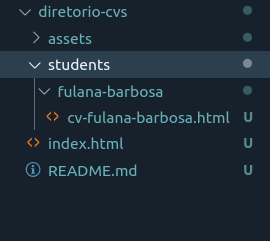

# reprograma-CV
Código criado para a página de currículos da {reprograma}

## Para adicionar seu currículo:
- Crie uma pasta com seu *nome-sobrenome* (como a pasta exemplo **fulana-barbosa**) dentro da pasta **students**.
- Copie e cole o **cv_template.html** (que está dentro da pasta exemplo **fulana-barbosa**) e remeie com seu *cv-nome-sobrenome*.

### No index.html:
- Em section class="students", copie a div exemplo e substitua com seu nome o **id="student-name"** e o texto da div class="name".
- Complete o link para a págino do seu currículo em **href="./students/"**

#### Orientações sobre entrega do exercício:
- Data de entrega - 13/12/2019 (sexta-feira): conta como presença
- Através de pull request neste repositório: criar uma branch e um pasta com seu nome para adicionar a solução do exercício
- Aula de revisão/dúvidas: 12/12/2019 (quinta-feira) das 20h às 22h
